# Tic-Tac-Toe-2025
# 🎯 6-in-a-Row TicTacToe - Compose Multiplatform

A modern twist on the classic TicTacToe game built with Kotlin Multiplatform and Jetpack Compose. Features a larger 10x10 game board with 6-in-a-row win condition, complete with computer AI opponent and beautiful custom UI rendering across Android, iOS, and Desktop platforms.

## 🎮 Features

- **🎯 10x10 Game Board** - Larger playing field for extended strategy sessions
- **🏆 6-in-a-Row Win Condition** - More challenging than traditional 3-in-a-row
- **🤖 Smart Computer AI** - Play against an intelligent computer opponent
- **👥 Two Player Mode** - Classic head-to-head gameplay
- **📱 True Multiplatform** - Runs natively on Android, iOS, and Desktop
- **🎨 Custom Canvas UI** - Beautiful, smooth-rendering game board
- **✨ Winning Line Animation** - Visual highlight for winning combinations
- **🔄 Real-time State** - Reactive UI with instant state updates
- **🎯 Clean Architecture** - Well-structured, maintainable codebase

---

## 🏗️ Architecture Overview

This project implements **Clean Architecture with MVVM pattern**, ensuring clear separation of concerns, testability, and platform independence.

```project structure
📱 Presentation Layer (UI Components)
├── App.kt (Root composable)
├── GameScreen.kt (Main screen)
└── Board Components (Canvas rendering)

🎭 ViewModel Layer (State Management)
└── GameViewModel.kt (Business logic coordinator)

🎯 Domain Layer (Pure Business Logic)
└── GameEngine.kt (Game rules & win conditions)

💾 Data Layer (Models & State)
├── Cell.kt (X, O, EMPTY)
├── GameMode.kt (TWO_PLAYER, VS_COMPUTER)
└── WinResult.kt (Win state data)

🔧 Infrastructure Layer
├── di/ (Dependency Injection with Koin)
└── platform/ (Platform-specific implementations)


```

 ---

## 📊 Tech Stack Architecture
This project leverages a modern, multiplatform tech stack designed for maximum code sharing, performance, and developer productivity. The architecture is built around Kotlin Multiplatform with Jetpack Compose, enabling true cross-platform development.

```mermaid
graph TB
    %% Core Platform Layer
    A[Kotlin Multiplatform<br/>v2.0.21<br/>Core Foundation]
    A --> B[Jetpack Compose UI<br/>v1.7.0<br/>Declarative UI Framework]
    A --> C[Koin DI<br/>v4.0.0<br/>Dependency Injection]
    A --> D[Kotlin Coroutines<br/>v1.9.0<br/>Async Programming]
    A --> E[Kotlinx Serialization<br/>v1.7.3<br/>JSON Serialization]
    
    %% Platform Targets
    B --> F[Android<br/>minSdk 24<br/>Material Design]
    B --> G[iOS<br/>Arm64/Simulator<br/>Native Performance]
    B --> H[Desktop<br/>JVM 11<br/>Native Distributions]
    
    %% DI Components
    C --> I[AppModule.kt<br/>Dependency Graph<br/>singles & factories]
    C --> J[KoinHelper.kt<br/>Lifecycle Management<br/>initKoin/disposeKoin]
    
    %% Async Architecture
    D --> K[CoroutineScope<br/>SupervisorJob<br/>Structured Concurrency]
    D --> L[CoroutineExceptionHandler<br/>Global Error Handling<br/>Crash Reporting]
    
    %% Serialization Flow
    E --> M[Ktor Serialization<br/>Network Data<br/>Content Negotiation]
    E --> N[Game State<br/>Local Data<br/>Model Serialization]
    
    %% Game Architecture
    O[Game Engine<br/>Pure Business Logic<br/>10x10 Board, 6-Win Condition]
    O --> P[Win Detection<br/>Horizontal/Vertical/Diagonal<br/>Algorithm Optimization]
    O --> Q[Board Management<br/>State Validation<br/>Game Rules]
    
    %% State Management
    R[GameViewModel<br/>State Holder<br/>mutableStateOf Reactive]
    R --> S[UI State<br/>Compose Observables<br/>Automatic Recomposition]
    R --> T[Event Handling<br/>User Interactions<br/>Game Actions]
    
    %% Cross-Cutting Concerns
    U[Platform Interface<br/>expect/actual Pattern<br/>Platform-Specific Impls]
    V[Compose Canvas<br/>Custom Rendering<br/>60fps Game Board]
    
    %% Styling for Key Components
    style A fill:#7e57c2,stroke:#333,stroke-width:3px,color:#fff
    style B fill:#2196f3,stroke:#333,stroke-width:3px,color:#fff
    style O fill:#ff9800,stroke:#333,stroke-width:3px,color:#fff
    style R fill:#4caf50,stroke:#333,stroke-width:3px,color:#fff
    style F fill:#34c759,stroke:#333,stroke-width:2px,color:#000
    style G fill:#007aff,stroke:#333,stroke-width:2px,color:#fff
    style H fill:#ff9500,stroke:#333,stroke-width:2px,color:#000
```



---

 ## 🌟 Core Framework & Languages
Kotlin Multiplatform enables full code sharing across platforms with native performance and seamless interoperability.
Jetpack Compose Multiplatform provides a declarative, cross-platform UI with hot reload and Material 3 support, built using Android Gradle Plugin for modern build tooling and version management.

| Component                          | Version | Purpose        | Key Features                                                               |
|------------------------------------|---------|----------------|----------------------------------------------------------------------------|
| **Kotlin Multiplatform**           | 2.0.21  | Core Language  | • 100% Code Sharing<br>• Platform Native Performance<br>• Interoperability |
| **Jetpack Compose Multiplatform**  |  1.7.0  | UI Framework   | • Declarative UI<br>• Hot Reload<br>• Material 3                           |
| **Android Gradle Plugin**          | 8.5.2   | Build System   | • Modern Build Tools<br>• Version Catalogs<br>• Composition                |


## 🏗️ Dependency Injection
Koin provides a lightweight, Kotlin-native dependency injection framework for Android and Compose.
It allows easy declaration of singletons, Android integration, and Compose-specific injection with minimal boilerplate.

| Library        | Version | Role                 | Implementation                  |
|----------------|---------|----------------------|----------------------------------|
| **Koin Core**  | 4.0.0   | DI Framework         | `single { GameEngine() }`        |
| **Koin Android** | 4.0.0 | Android DI           | `koinAndroid`                    |
| **Koin Compose** | 4.0.0 | Compose Integration  | `koinInject()`                   |


```kotlin
val appModule = module {
    single { GameEngine() }                     // Singleton business logic
    factory { GameViewModel(get()) }            // Factory for ViewModels
    single { CoroutineExceptionHandler { } }    // Error handling
    single { CoroutineScope(SupervisorJob()) }  // Async operations
}
```

---


## 🎨 UI & Graphics Stack
Compose Multiplatform provides a declarative UI framework for building responsive and reusable components across platforms.
It includes state management, layouts, Material 3 design system, custom components, and resource handling for modern, cross-platform UIs.

### Compose Multiplatform Components

| Component            | Usage               | Features                          |
|----------------------|---------------------|-----------------------------------|
| **Compose Runtime**  | State Management    | `mutableStateOf()`                |
| **Compose Foundation** | Basic Layouts     | `Column`, `Row`, `Box`            |
| **Compose Material3** | Design System      | `MaterialTheme`, `Button`         |
| **Compose UI**       | Custom Components   | `Canvas`, `Modifier`              |
| **Compose Resources** | Asset Management   | `painterResource()`               |


# 🎨 Custom Canvas Rendering
BoardCanvas is a Composable that renders the game board using a custom Canvas with scalable cell size.
It draws grid lines, X/O symbols, and highlights winning positions, providing a fully interactive and visually clear game interface.

```kotlin
@Composable
fun BoardCanvas(
    board: List<List<Cell>>,
    winningPositions: List<Pair<Int, Int>>,
    cellSize: Dp,
    boardSize: Int
) {
    Canvas(modifier = Modifier.size(cellSize * boardSize)) {
        drawGridLines(boardSize)        // Custom grid drawing
        drawCells(board, boardSize)     // X/O symbols
        drawWinningLine(winningPositions, boardSize) // Win highlight
    }
}
```
---

## 🔄 Asynchronous Programming
Kotlinx Coroutines enables efficient asynchronous programming with structured concurrency for Kotlin applications.
It provides core coroutine support, seamless async operations, and integration with desktop platforms like Swing for responsive UIs.

### Coroutines Stack

| Library                | Version | Purpose             |
|------------------------|---------|---------------------|
| **Kotlinx Coroutines** | 1.9.0   | Async Operations    |
| **Coroutines Core**    | 1.9.0   | Core Coroutines     |
| **Coroutines Swing**   | 1.9.0   | Desktop Integration |

---

### 🎭 Structured Concurrency (Koin Module)
This Koin module sets up structured concurrency with a centralized CoroutineExceptionHandler for global error handling.
It provides a CoroutineScope with a SupervisorJob, ensuring safe, isolated, and manageable asynchronous tasks across the app.

```kotlin
val coroutineModule = module {
    single {
        CoroutineExceptionHandler { _, throwable ->
            // Centralized error handling
            println("Global coroutine error: ${throwable.message}")
        }
    }
    
    single {
        CoroutineScope(SupervisorJob() + get<CoroutineExceptionHandler>())
    }
}
```
---

## 🌐 Networking & Serialization
Ktor Client provides a multiplatform HTTP client with flexible engines for Android, JVM, and iOS.
It supports JSON serialization, logging, and authentication, enabling robust and maintainable network communication across platforms.

### Ktor Client Stack

| Component              | Version | Platform       | Purpose              |
|------------------------|---------|----------------|----------------------|
| **Ktor Client Core**   | 3.0.0   | All            | HTTP Client Base     |
| **Ktor OkHttp**        | 3.0.0   | Android/JVM    | HTTP Engine          |
| **Ktor Darwin**        | 3.0.0   | iOS            | HTTP Engine          |
| **Ktor Serialization** | 3.0.0   | All            | JSON Handling        |
| **Ktor Logging**       | 3.0.0   | All            | Network Debugging    |
| **Ktor Auth**          | 3.0.0   | All            | Authentication       |

#Ktor Bundle Configuration:
```kotlin
  [bundles]
ktor = [
    "ktor-client-core",
    "ktor-client-content-negotiation", 
    "ktor-client-auth",
    "ktor-client-logging",
    "ktor-serialization-kotlinx-json",
]
```

#Coil Bundle:
```kotlin
 [bundles]
coil = [
    "coil-compose",
    "coil-compose-core", 
    "coil-network-ktor2",
    "coil-network-ktor3",
    "coil-mp"
]
```
---

## 💾 Data Persistence
Room Database provides a robust ORM for Kotlin, offering SQLite abstraction with compile-time query verification.
It integrates code generation, multiplatform SQLite support, and KSP validation for safe and efficient data persistence.

### Room Database Stack

| Component         | Version          | Purpose          | Features                                                                 |
|-------------------|------------------|------------------|---------------------------------------------------------------------------|
| **Room Runtime**  | 2.7.0-alpha11    | ORM Library      | • SQLite Abstraction<br>• Compile-time Verification                      |
| **Room Compiler** | 2.7.0-alpha11    | Code Generation  | • KSP Integration<br>• Query Validation                                  |
| **SQLite Bundled**| 2.5.0-alpha11    | Database Engine  | • Multiplatform SQLite                                                   |

```kotlin
 room {
    schemaDirectory("$projectDir/schemas")
}
```
## 🎯 Game-Specific Technologies
GameEngine implements core game logic in pure Kotlin, handling board state and win conditions.
It supports multi-directional checks—horizontal, vertical, and diagonal—ensuring platform-independent gameplay mechanics.

```kotlin
class GameEngine {
    private val size = 10
    private val winLength = 6
    
    // Pure Kotlin business logic
    fun checkWin(board: List<List<Cell>>): WinResult? {
        // Multi-directional win checking
        // Horizontal, Vertical, Diagonal
    }
}
```

---

## 📱 Platform Support Matrix
The project supports Android, iOS, and Desktop, ensuring broad device compatibility with modern SDKs and build tools.
It provides native frameworks for iOS, multiplatform installers for desktop (DMG, MSI, DEB), and optimized Android targets for seamless deployment.

### Android

| Component      | Version | Configuration            |
|----------------|---------|---------------------------|
| **Compile SDK** | 35      | Latest Android API        |
| **Min SDK**     | 24      | Android 7.0+              |
| **Target SDK**  | 35      | Optimization Target        |
| **Build Tools** | 8.5.2   | Modern Build System        |

---

### iOS

| Architecture          | Support | Framework Type     |
|-----------------------|---------|----------------------|
| **iOS Arm64**         | ✅       | Native Device        |
| **iOS Simulator Arm64** | ✅     | M1/M2 Simulator      |
| **Framework**         | Static  | `isStatic = true`    |

---

### Desktop

| Platform | Format | Distribution          |
|----------|--------|------------------------|
| **macOS** | DMG    | Apple Disk Image       |
| **Windows** | MSI  | Microsoft Installer    |
| **Linux** | DEB    | Debian Package         |

---

## 🔧 Build & Development Tools
Gradle Configuration leverages Kotlin Gradle Plugin, Compose Compiler, and KSP to streamline multiplatform builds.
It enables efficient code generation, symbol processing, and seamless compilation for Kotlin and Compose projects.

### Gradle Configuration

| Tool                     | Version            | Purpose                   |
|--------------------------|--------------------|---------------------------|
| **Kotlin Gradle Plugin** | 2.0.21             | Kotlin Build Support      |
| **Compose Compiler**     | 2.0.21             | Compose Code Generation   |
| **KSP**                  | 2.0.20-1.0.24      | Kotlin Symbol Processing  |


---

# 🎯 Game Rules & How to Play

## 🎮 Basic Rules

| Rule | Description |
|------|-------------|
| **Board Size** | 10×10 grid (100 total cells) |
| **Objective** | Be the first to get 6 of your symbols in a row |
| **Valid Lines** | Horizontal, vertical, or diagonal |
| **Turns** | Players alternate placing X and O |
| **Game End** | When one player gets 6 in a row or board is full |

## 🎪 Game Modes

### 👥 Two Player Mode
- 🎭 Play against a friend on the same device
- 🔄 Take turns placing X and O
- 🏠 Perfect for local multiplayer

### 🤖 VS Computer Mode
- 🧠 Challenge the built-in AI opponent
- ⚡ Computer plays as O with strategic moves
- 🎯 Great for solo practice

## 🏆 Winning Strategies

### 🛡️ Block Opponent
- Prevent your opponent from getting 6 in a row
- Always watch for their potential winning moves

### 🎯 Build Multiple Threats
- Create several potential winning lines simultaneously
- Force your opponent into defensive positions

### 🎪 Center Control
- The center of the board offers more opportunities
- Control the central cells for better positioning

### 📍 Edge Awareness
- Use edges to limit opponent's options
- Corner positions can create unique winning paths

## 🚀 Quick Start

1. **Choose your game mode** - Two Player or VS Computer
2. **Take turns** placing your symbols on the grid
3. **Aim for 6 in a row** - horizontal, vertical, or diagonal
4. **Block your opponent** from completing their line
5. **Win the game** by being the first to connect 6!

## 💡 Pro Tips

- 🔍 Always scan the entire board for potential threats
- ⚡ Think 2-3 moves ahead
- 🎯 Balance between attacking and defending
- 📊 Use the whole board - don't cluster in one area


## 📱 Screenshots

<div align="center">
  
| Android | iOS | Desktop |
|:-------:|:---:|:-------:|
|  |  |  |

</div>
